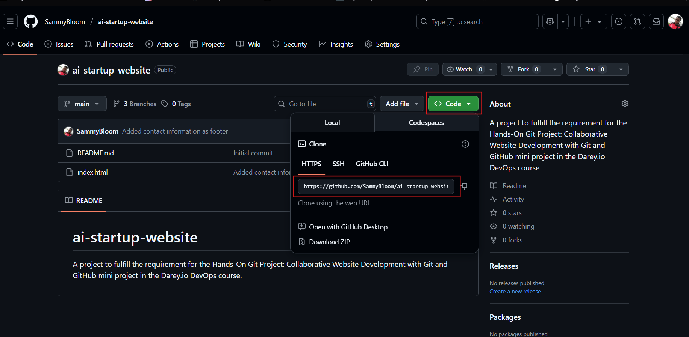
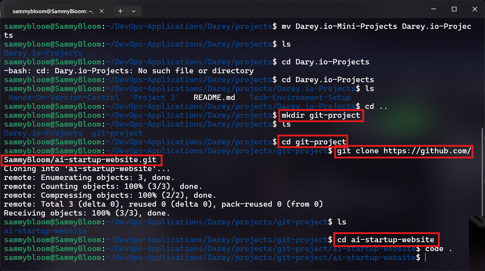
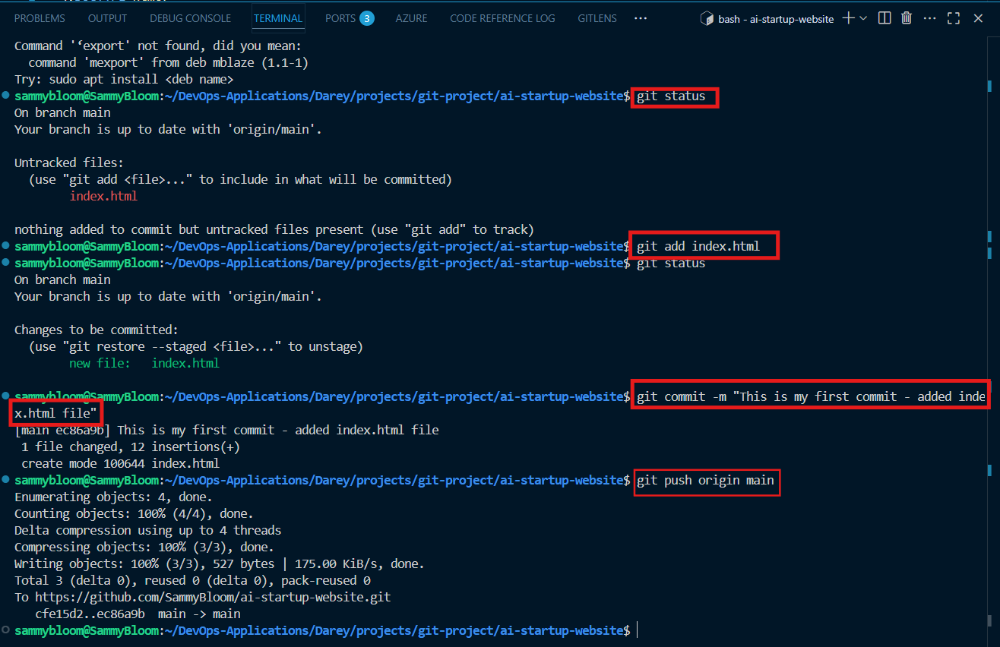
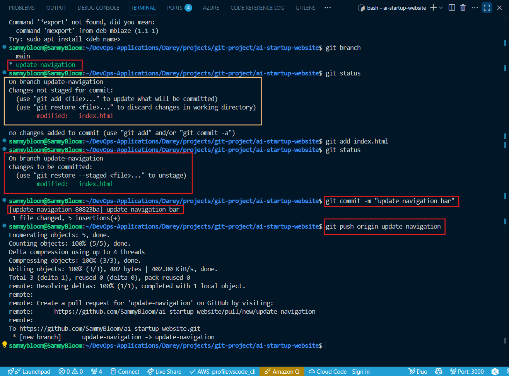
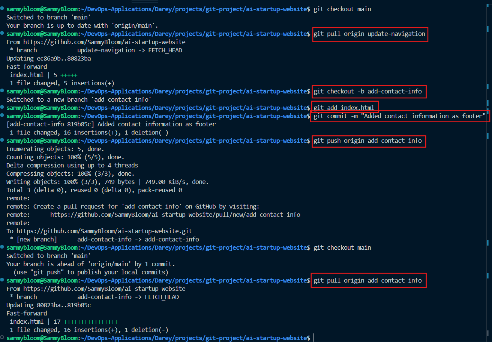
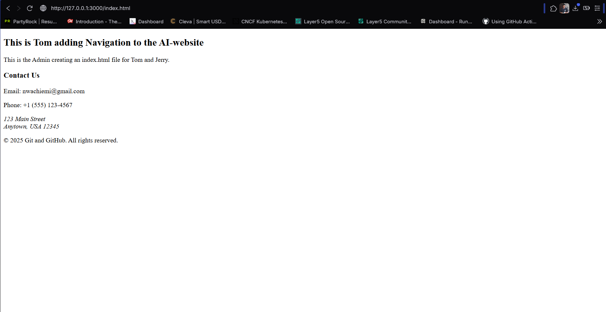

# Hands-On Git Project: Collaborative Website Development with Git and GitHub
In this mini project, we'll create a step-by-step project to simulate the workflow of Tom and Jerry using Git and GitHub. This hands-on project will include installation of Git, setting up a GitHub repository, cloning the repository, creating branches, making changes, and merging those changes back into the main branch.

## AI Startup Website
A project to fulfill the requirement for the Hands-On Git Project: Collaborative Website Development with Git and GitHub mini project in the Darey.io DevOps course.

## Real-Life Scenario
If a member "Tom" makes changes to the home page file "index.html" to update the navigation and at the same time, another team member "Jerry" makes changes to add contact information to the footer of the same home page thereby editing the same index.html file. Without VCS, the last person to upload their version of the file to the shared folder or server would overwrite the other person's changes, resulting in lost work.

## Solution

### Part 1: Setup and Initial Configuration
1. Download and install Git - https://git-scm.com
2. Signup/Login in to GitHub.
3. Create a new repository.
4. Copy repository link from dashboard

5. Create a new directory _**git-project**_ and Clone repository to local device.

6. Open code editor, write code, commit and push to GitHub.

### Part 2: Simulating Tom and Jerry's Work.
1. Tom's Work

2. Jerry's Work

The website shows like this:

The repository link is this: https://github.com/SammyBloom/ai-startup-website.git